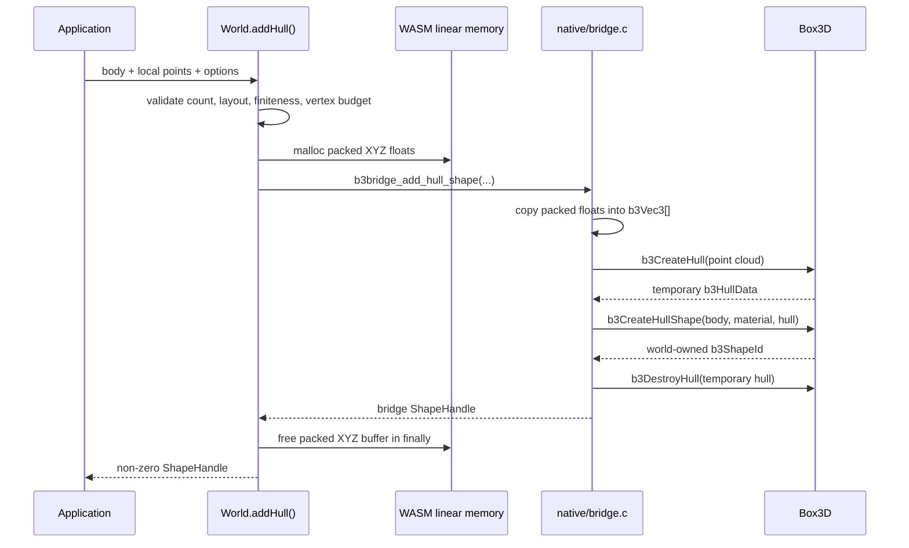

# Convex Hull Colliders, from First Principles to `World.addHull()`

> A student-oriented lesson and implementation reference for `three-box3d`.
>
> Implementation and research review date: **2026-08-02**<br>
> Wrapped native engine: **box3d v0.1.0**, commit
> [`8441b4a`](https://github.com/erincatto/box3d/tree/8441b4a06d6d09dcfb0b0f704df4d847d1437b92)<br>
> WebAssembly toolchain used for verification: **Emscripten 6.0.2**

## The one idea to remember

The render mesh answers **“what does this object look like?”** The collider answers
**“where is matter allowed to touch and push other matter?”** They may share the
same source geometry, but they have different jobs and should usually have different
levels of detail.

For an irregular but convex demolition fragment, a surrounding box is too loose and
a full triangle mesh is unnecessarily expensive. One bounded convex hull is the
useful middle ground: close enough to the visible fragment to make contacts believable,
but structured enough for a real-time rigid-body solver.

This chapter explains why that is true, how the new `World.addHull()` API implements
it across TypeScript, WebAssembly, C, and Box3D, what the implementation does **not**
solve, and where collision-shape research is heading next.

## Reader contract

- **Reader:** a developer or student who knows basic TypeScript and can read simple C,
  but does not need prior physics-engine experience.
- **Question:** why do convex hull colliders improve demolition, and how does this
  implementation carry geometry safely from JavaScript into Box3D?
- **Change:** after reading, you should be able to choose between a primitive, one
  hull, several hulls, and a triangle mesh; trace `addHull()` end to end; and identify
  the next engineering work needed for production demolition.
- **Takeaway:** use the simplest collider that preserves the physical behavior you
  care about; for an already-convex fracture cell, that is normally one convex hull.

## 1. The original problem: a box contains empty space

An axis-aligned bounding box, or AABB, is the smallest box aligned with the coordinate
axes that contains a shape. It is excellent for quickly asking “could these objects
possibly overlap?” It is poor as the final contact surface for an irregular fragment.

Imagine a tetrahedron occupying one corner of a unit cube. The box collider fills the
entire cube, including the opposite corner where no visible material exists. A ball can
therefore bounce off empty space.

The same error is more distracting in demolition:

- sloped concrete faces behave like invisible vertical walls;
- rubble balances on empty corners instead of settling into gaps;
- a projectile can hit the box around a fragment before reaching its visible surface;
- piles remain unnaturally open because box corners keep pieces apart;
- holes look blocked even though the renderer shows open space.

The regression test in
[`packages/core/test/world.test.ts`](../packages/core/test/world.test.ts#L1109)
captures exactly this distinction. A small sphere is placed where it overlaps a
tetrahedron's AABB but lies far outside the tetrahedron itself. The sphere collides
with an actual box in the control case and does **not** collide with the hull.

### A crucial clarification: Box3D still uses bounds

Replacing a box collider with a convex hull does not remove AABBs from the engine.
Physics engines normally split collision detection into two stages:

1. The **broad phase** uses cheap bounds to reject object pairs that are far apart.
2. The **narrow phase** examines the actual collision shapes and creates contact
   points only when their surfaces are close enough.

The old demolition proxy effectively stopped at the broad approximation. With
`addHull()`, Box3D may still use an AABB to find a candidate pair, but its narrow phase
tests the convex surfaces before producing a physical response.

## 2. What “convex” means

A solid is convex when the straight line segment between any two points inside the
solid also stays inside the solid.

Examples:

- a box is convex;
- a sphere is convex;
- a tetrahedron is convex;
- most individual Voronoi fracture cells are convex;
- a crescent, arch, U-shape, tunnel, or wall with a hole is concave.

A useful mental model for a convex hull is a tight rubber sheet wrapped around a set
of points in three dimensions. Interior points do not change the sheet. Points on a
flat face may not become corners. Only the extreme points determine the final hull.
Jolt's hull documentation explicitly notes that a point cloud may contain interior,
face, and edge points; the hull builder determines which points matter.

### Why convex shapes are solver-friendly

For two separated convex objects, there is always a plane that separates them. This
property makes robust algorithms such as the Separating Axis Theorem (SAT) and GJK
practical. Engines can search support points, separating planes, faces, and edges
without reasoning about arbitrary cavities.

The Box3D version pinned here uses SAT-oriented hull contact generation. Its
[`b3CollideHulls`](https://github.com/erincatto/box3d/blob/8441b4a06d6d09dcfb0b0f704df4d847d1437b92/src/convex_manifold.c#L1305)
path caches likely separating axes, tests face and edge candidates, and builds a
contact manifold. Convexity is what makes those surface tests manageable.

### What a convex hull deliberately loses

A single convex hull fills every cavity in its input. If you pass the vertices of a
U-shaped object, the hull spans across the open top. If you pass an intact wall with
a hole, the hull closes the hole. This is not a bug in hull construction; it is the
definition of convexity.

That gives us the first decision rule:

> One convex source piece → one hull. One concave source piece → multiple hulls, a
> suitable static mesh, or a different representation.

## 3. Choosing the right collision representation

| Representation | Best use | Strength | Main limitation |
| --- | --- | --- | --- |
| Sphere, capsule, box | Simple bodies and high object counts | Cheapest and most stable | Loose fit on irregular geometry |
| One convex hull | One irregular convex fragment | Tight surface with real-time contacts | Fills every cavity |
| Compound of convex hulls | Dynamic concave object | Preserves major cavities | More shapes and contacts |
| Triangle mesh | Detailed static environment or queries | Can preserve exact surface topology | Expensive and difficult for dynamic rigid bodies |
| Signed distance field | Specialized dynamic mesh/GPU pipelines | Represents detailed surfaces and penetration distance | Memory-heavy and not part of this CPU/WASM path |

For the current demolition system:

- A generated convex Voronoi fragment should use one `addHull()` call.
- A concave authored asset should be decomposed into several convex pieces first.
- A hole in a destructible wall should be represented by removing or separating the
  cells that used to occupy it, not by taking one hull of the remaining wall.
- Tiny distant rubble may still use boxes or lower-vertex hulls if the difference is
  visually irrelevant.

This is an engineering tradeoff, not a contest to make physics geometry identical to
render geometry.

## 4. What we chose to build

The public API is:

```ts
interface HullOptions extends ShapeMaterial {
  maxVertices?: number;
}

world.addHull(
  body,
  points, // readonly Vec3[] or packed Float32Array of XYZ triples
  {
    density: 2,
    friction: 0.7,
    restitution: 0,
    rollingResistance: 0,
    maxVertices: 64,
  },
);
```

The points are **body-local**, not world-space. If the body is at `[10, 3, -2]`, a
local point `[0.5, 0, 0]` is still expressed relative to that body's origin. Box3D
applies the body's position and rotation during simulation.

Only positions cross this API. Triangle indices, winding order, normals, UVs, and
materials from the render mesh are not hull-builder inputs. The caller may supply a
point cloud containing duplicate or interior positions, although deduplicating a
triangle soup first avoids wasted construction work.

Two input forms are supported:

```ts
// Readable form
world.addHull(body, [
  [0, 0, 0],
  [1, 0, 0],
  [0, 1, 0],
  [0, 0, 1],
]);

// Allocation-friendly packed form for generated geometry
world.addHull(
  body,
  new Float32Array([
    0, 0, 0,
    1, 0, 0,
    0, 1, 0,
    0, 0, 1,
  ]),
);
```

The implementation defaults `maxVertices` to 64. That is a policy choice for rubble:
it gives the native builder room to preserve meaningful planes without encouraging
render-mesh detail in every sleeping fragment. Box3D stores hull topology with an
8-bit limit; this wrapper therefore accepts `4..255`, while native construction can
still reject a result whose vertex, face, or half-edge counts reach its internal limit.
`maxVertices` is a ceiling, not a request for exactly that many corners; a simple
point cloud normally produces fewer.

`HullOptions` inherits the shared shape-material surface. Density, friction, and
restitution affect hull behavior. The native material also receives
`rollingResistance`, but Box3D documents rolling resistance as a sphere/capsule
feature, so callers should not expect it to change a polyhedral hull's motion.

### Goals

- expose Box3D's existing hull builder through a small typed API;
- preserve material properties already supported by boxes, spheres, and capsules;
- accept generated point clouds without requiring caller-authored face topology;
- fail clearly for invalid or degenerate input;
- work with older cached WASM by exposing a capability flag;
- never return handle `0` as if it were a valid shape;
- rebuild and verify every shipped WASM variant.

### Non-goals

- automatic convex decomposition;
- preserving concavity in one call;
- extracting points directly from Three.js `BufferGeometry`;
- changing Box3D's hull algorithm;
- rebuilding a collider on every simulation frame;
- providing a dynamic triangle-mesh collider.

## 5. The end-to-end implementation

The important work was not inventing a new collision algorithm. Box3D already had
`b3CreateHull`, `b3CreateHullShape`, hull mass properties, and hull contact generation.
The work was to expose that capability safely across the JavaScript/WASM boundary.



### Step 1: define the public types and limits

[`packages/core/src/types.ts`](../packages/core/src/types.ts#L62) defines
`HullOptions`, `DEFAULT_HULL_MAX_VERTICES`, and `HULL_MAX_VERTICES_LIMIT`. It also
adds `Capabilities.convexHull` so callers can distinguish a current binary from an
older WASM artifact.

This separation matters because TypeScript source and a cached `.wasm` file can get
out of sync. A method existing in JavaScript does not prove that the native function
was compiled into the binary.

### Step 2: describe the optional native export

[`packages/core/src/raw-module.ts`](../packages/core/src/raw-module.ts#L79) describes
the C ABI function:

```ts
b3bridge_add_hull_shape?(
  bodyHandle,
  pointsPointer,
  pointCount,
  maxVertexCount,
  density,
  friction,
  restitution,
  rollingResistance,
): number;
```

The question mark is intentional. It lets the module type represent older WASM
binaries without lying about the export: `raw-module.ts` permits absence,
`capabilities.ts` reports it, and the public method throws when called against such a
binary. The loader's narrower job is to instantiate the binary it receives.

### Step 3: probe the runtime capability

[`packages/core/src/capabilities.ts`](../packages/core/src/capabilities.ts#L68)
checks whether `b3bridge_add_hull_shape` is actually a function. That becomes
`probeCapabilities(world).convexHull`.

Capability detection is safer than version-string guessing. A custom or partially
rebuilt binary can report what it truly contains.

### Step 4: validate and marshal in TypeScript

[`packages/core/src/world.ts`](../packages/core/src/world.ts#L430) implements the
public method. Its order is deliberate:

1. Assert that the world is still alive.
2. Validate `maxVertices` as an integer in `4..255`.
3. Accept either `Vec3[]` or a packed `Float32Array`.
4. Require at least four points and finite coordinates.
5. Check that the native export exists **before** allocating.
6. Allocate `pointCount × 3 × 4` bytes in WASM linear memory.
7. Write tightly packed XYZ floats into the current `HEAPF32` view.
8. Call the native bridge.
9. Turn native return value `0` into a clear JavaScript error.
10. Free the packed input in `finally`, on both success and failure.

The fresh `HEAPF32` access is important because WebAssembly memory growth can replace
typed-array views. Holding an old view across growth is unsafe.

### Step 5: translate the ABI in C

[`native/bridge.c`](../native/bridge.c#L426) implements
`b3bridge_add_hull_shape`.

The WebAssembly ABI receives a tightly packed `float*`: `x, y, z, x, y, z, ...`.
The bridge copies those values into native `b3Vec3` objects rather than making the
public ABI depend on a C struct's size or alignment. The currently pinned `b3Vec3`
is three floats, but the explicit copy keeps that internal detail out of the API.

The bridge then:

1. validates the body handle, pointer, point count, vertex limit, and every float;
2. calls Box3D's
   [`b3CreateHull`](https://github.com/erincatto/box3d/blob/8441b4a06d6d09dcfb0b0f704df4d847d1437b92/src/hull.c#L2023);
3. constructs a material-aware `b3ShapeDef`;
4. attaches the hull with
   [`b3CreateHullShape`](https://github.com/erincatto/box3d/blob/8441b4a06d6d09dcfb0b0f704df4d847d1437b92/src/shape.c#L348);
5. destroys the temporary hull after Box3D clones/interns it into the world;
6. allocates a bridge-level shape handle only after native shape creation succeeds.

The native hull builder is QuickHull-style code. It shifts points relative to an
input origin for construction, enforces bounded topology, rejects invalid hulls, and
packages vertices, planes, faces, and half-edges into `b3HullData`.

### Step 6: export and rebuild the binary

Adding C code is not enough. WebAssembly exposes only symbols selected at link time.
[`native/expected-exports.txt`](../native/expected-exports.txt#L53) now includes
`_b3bridge_add_hull_shape`. The build script verifies that the actual binary contains
the complete expected surface and that compatibility and SIMD variants have export
parity.

The implementation rebuilt:

- `native/dist/box3d.wasm` — legacy/default artifact;
- `native/dist/box3d.compat.wasm` — scalar compatibility artifact;
- `native/dist/box3d.simd.wasm` — SIMD artifact;
- the corresponding package copies under `packages/core/wasm/`.

### Step 7: export the ergonomic API

[`packages/core/src/index.ts`](../packages/core/src/index.ts#L87) adds `addHull()` to
the public `World` interface and exports the options and constants. Consumers never
need to call the raw ABI or manage pointers themselves.

## 6. Memory ownership: who frees what?

Crossing JavaScript, WebAssembly, and C creates several objects with different
lifetimes. The implementation is safe only if each one has a clear owner.

| Allocation | Created by | Freed or owned by | Lifetime |
| --- | --- | --- | --- |
| Caller `Vec3[]` / `Float32Array` | Application | Application/JavaScript GC | Independent of the shape |
| Packed XYZ buffer in WASM memory | TypeScript wrapper | `World.addHull()` in `finally` | One bridge call |
| Temporary native `b3Vec3[]` copy | C bridge | C bridge immediately after hull construction | One hull build |
| Temporary `b3HullData` | `b3CreateHull` | C bridge via `b3DestroyHull` after shape creation | One native shape creation |
| Native shape geometry | Box3D world | Box3D when shape/body/world is destroyed | Simulation lifetime |
| Public `ShapeHandle` entry | C bridge registry | Existing shape/body/world destruction paths | Simulation lifetime |

There is one inherited bridge edge case worth knowing: if the fixed bridge shape
registry is exhausted after Box3D has already attached a native shape, handle
allocation returns `0`. The JavaScript call throws, but that native shape remains
attached until its body or world is destroyed. This is not specific to hulls—the
existing primitive creation paths use the same registry sequence—but it is a future
hardening target.

## 7. Failure cases and what they teach

### Fewer than four points

A three-dimensional convex volume needs at least four non-coplanar points. Four input
points are necessary but not sufficient: four points in one plane still have zero
volume.

### Coplanar or otherwise degenerate points

The native builder can return `NULL`. The wrapper turns that into an exception rather
than a fake `ShapeHandle`. In production, a caller may choose a conservative box or
oriented-box fallback, but that policy should be explicit and observable.

### Duplicate and interior points

They do not define new hull corners. Some native hull builders clean or tolerate them,
but the wrapper does not guarantee success for every duplicated or near-degenerate
cloud. Sending thousands of redundant render vertices also increases construction
work. A Three.js adapter should weld or deduplicate positions before calling the core
API.

### Concave input

The call succeeds, but the result is the convex envelope. It silently fills holes and
cavities because that is the requested mathematical operation. `addHull()` cannot
infer that the caller wanted several pieces.

### World-space points

Passing world-space vertices and also positioning the body applies the transform
twice. Recenter each fragment around its chosen body origin, pass those local points,
and set the body's world transform separately.

### Very large coordinates or badly scaled geometry

Hull tolerances and floating-point precision are scale-sensitive in every engine.
Keep objects in a consistent physical unit system and local coordinates near their
body origin. The [CoACD project README](https://github.com/SarahWeiii/CoACD), reviewed
on 2026-08-02, announces a 2026 real-metric mode; it is one sign that practical
decomposition pipelines increasingly treat scale as an explicit input rather than an
afterthought.

### Excessive vertex budgets

More vertices can improve fit, but also increase hull cooking, memory, face/edge
tests, and possible contact features. A higher number is not automatically “more
physical.” Benchmark the pile and projectile cases that matter.

### Excessive input point counts

The current API validates point structure and finiteness but does not impose a maximum
input `pointCount`. A huge triangle soup can therefore request excessive temporary
WASM/native memory and hull-construction time even when `maxVertices` is small. A
future hardening pass should establish a measured input cap, reject integer-overflow
risk at both boundaries, and encourage deduplicated source points.

## 8. What the tests prove—and what they do not

The hull suite in
[`packages/core/test/world.test.ts`](../packages/core/test/world.test.ts#L979)
covers:

- fewer than four points;
- non-finite coordinates;
- invalid vertex limits;
- malformed packed buffers;
- a successful packed `Float32Array` call;
- an irregular dynamic hull falling and contacting a ground shape;
- the tetrahedron-versus-AABB empty-corner distinction;
- clear failure for coplanar points;
- repeated failure churn followed by another successful allocation;
- public exports and capability detection.

The loader and variant tests also verify that the WASM artifacts load and that named
compatibility/SIMD builds expose compatible surfaces.

The empty-corner test is the most important product-level proof. A non-zero handle
would only show that construction returned something. The control comparison shows
that the narrow-phase behavior is actually different from a box proxy.

The tests do **not** yet prove:

- a particular frame-time budget for hundreds of rubble hulls;
- exact heap-leak counts under instrumentation;
- deterministic hull topology across future Box3D versions;
- quality of a Three.js mesh-to-local-point conversion;
- behavior of compound concave objects;
- long-running mobile thermal performance.

Capability detection also proves export **presence**, not that a custom binary has the
correct signature or behavior. Functional hull tests remain necessary for a release
artifact. The loader keeps a legacy 55-export compatibility path, so export-count
acceptance by itself is intentionally not proof that hull creation ran.

Those are separate acceptance criteria, not facts we should infer from unit tests.

## 9. Reproducing the build and verification

With a local emsdk checkout:

```bash
export EMSDK_DIR=/path/to/emsdk
./native/scripts/build-wasm.sh --variant all
./native/scripts/build-wasm.sh
npm run sync-wasm -w box3d-web
npm run test -w box3d-web
npm run typecheck
npm run build
```

`--variant all` creates the named compatibility and SIMD artifacts. The second call
updates the legacy/default artifact. `sync-wasm` copies native WASM outputs into the
publishable `box3d-web` package and verifies each copy by SHA-256.

The implementation was reproduced on Windows with the pinned official Docker image:

```powershell
docker run --rm -v "${PWD}:/src" -w /src emscripten/emsdk:6.0.2 `
  bash -lc "EMSDK_DIR=/emsdk ./native/scripts/build-wasm.sh --variant all && EMSDK_DIR=/emsdk ./native/scripts/build-wasm.sh"
npm.cmd run sync-wasm -w box3d-web
npm.cmd run test -w box3d-web
npm.cmd run typecheck
npm.cmd run build
```

Verification record on 2026-08-02:

- 123/123 `box3d-web` tests passed;
- all monorepo TypeScript checks passed;
- all three packages built successfully;
- legacy, compatibility, and SIMD WASM files exposed
  `b3bridge_add_hull_shape` with matching bridge export counts;
- `git diff --check` reported no whitespace errors.

The initial implementation was Grok-assisted. Final native ownership review, pinned
WASM rebuild, export inspection, geometry regression, and monorepo verification were
performed independently afterward.

## 10. Performance model for demolition

There are two different costs to reason about.

### Construction cost

`addHull()` builds or “cooks” the hull synchronously. Cost grows with the input point
cloud and the work needed to find a bounded hull. Do not call it every physics frame.

Good patterns:

- build known fracture-cell hulls before the player can hit the wall;
- reuse or pool bodies when the same fragment set is replayed;
- deduplicate triangle-soup vertices before cooking;
- amortize large batches instead of creating every possible fragment in one frame;
- keep visible chips that do not affect gameplay out of the rigid-body world.

For genuinely runtime-generated secondary fracture, the current API may still create
a noticeable impact-frame spike because hull cooking happens in the world module.
Moving cooking off the main thread would require an additional serializable cooked-hull
format or worker-friendly creation pipeline; `addHull()` alone does not provide that.

### Simulation cost

Once created, a hull is more expensive than a box but usually far cheaper than treating
every render triangle as dynamic contact geometry. Runtime cost depends on:

- the number of awake bodies;
- broad-phase candidate pairs;
- hull vertices, faces, and edges;
- contact manifold complexity;
- solver substeps;
- whether bodies are allowed to sleep;
- projectile speed and CCD settings.

This is why the correct production question is not “how detailed can the hull be?” It
is “what is the lowest collider complexity that preserves the contacts the player can
notice?”

## 11. The research landscape as of August 2026

### Established production direction: bounded convex cooking

[PhysX 5.1 geometry documentation](https://nvidia-omniverse.github.io/PhysX/physx/5.1.1/docs/Geometry.html)
describes convex-mesh cooking from point clouds, a 255-vertex/face limit, vertex
cleaning, bounded hull generation, validation, and mass/inertia calculation. It
recommends offline cooking when practical. Its low-vertex discussion specifically
mentions small debris as a use case.

[Jolt 5.3 hull settings](https://jrouwe.github.io/JoltPhysicsDocs/5.3.0/class_convex_hull_shape_settings.html)
expose hull tolerance and convex-radius error controls. Increasing tolerance can
reduce vertices, which suggests a future `three-box3d` direction beyond a single
vertex-count knob: let callers choose a geometric error budget.

The lesson is not that all engines use identical internals. It is that mature engines
turn arbitrary visual geometry into validated, bounded collision data before relying
on it in a solver.

### Current practical decomposition: CoACD

[CoACD](https://github.com/SarahWeiii/CoACD) decomposes a concave triangle mesh into
approximately convex components using a collision-aware concavity measure and tree
search. It directly exposes the quality-versus-piece-count tradeoff. Its April 2026
real-metric mode allows the threshold to be expressed in meters, useful for scanned or
CAD geometry with meaningful scale.

[V-HACD](https://github.com/kmammou/v-hacd) is archived and explicitly directs new
development to CoACD. For a new offline asset pipeline, CoACD is therefore the more
reasonable first evaluation than beginning new integration work on V-HACD.

### A newly standardized geometry-library option: CGAL 6.2

[CGAL 6.2](https://www.cgal.org/2026/06/11/cgal62/) added
`CGAL::approximate_convex_decomposition()`. Its method uses voxel analysis,
error-driven splitting, and merging to cover a closed mesh with a chosen number of
convex volumes while controlling extra covered volume. This broadens the set of
maintained, general-purpose options worth benchmarking for an offline toolchain.

Licensing and binary size need evaluation before embedding CGAL in a web-facing build;
the immediate relevance is as an offline authoring/cooking option, not a reason to put
CGAL into the runtime bundle.

### Emerging direction: fit simpler primitives, not only hulls

The 2026 preprint
[Convex Primitive Decomposition for Collision Detection](https://arxiv.org/abs/2602.07369)
fits editable convex primitives to complex meshes. On the authors' tested dataset, it
reports lower approximation error, less than one-third the collider byte complexity,
and faster rigid-body simulation than the compared V-HACD and CoACD outputs.

That is promising for arbitrary authored objects, but it is still a preprint with a
bounded evaluation. It does not make one exact hull obsolete for a fragment that is
already convex. It is a candidate for future asset-pipeline experiments, not a reason
to replace the current `addHull()` path today.

### Emerging direction: learned open-world decomposition

NVIDIA and UT Austin's CVPR 2026 work,
[Learning Convex Decomposition via Feature Fields](https://research.nvidia.com/labs/sil/projects/learning-convex-decomp/),
learns a continuous feature field and clusters it into convex components. The project
reports generalization across meshes, CAD, scans, and Gaussian splats. Its collision
demo reports a 5× step-time improvement over the original meshes in one Newton
simulation example, while the authors explicitly say broader testing is ongoing.

The interesting future possibility is not “AI inside every physics step.” It is a
better offline or background tool that proposes collision decompositions across many
messy source formats.

### Alternative direction: dynamic triangle meshes plus SDFs

PhysX documents dynamic triangle-mesh collision through signed distance fields in its
GPU collision pipeline. It also notes the memory cost and recommends sparse SDFs.
This is a real state-of-the-art path for hardware and workloads designed around it,
but it is not currently the practical default for a compact CPU/WebAssembly demolition
library. It belongs in long-range evaluation, especially if WebGPU physics becomes a
project goal.

### Demolition-specific foundation: local repeated fracture

The 2013 paper
[Real Time Dynamic Fracture with Volumetric Approximate Convex Decompositions](https://matthias-research.github.io/pages/publications/fractureSG2013.pdf)
remains conceptually important. It represents visual geometry with convex components,
applies impact-dependent fracture locally, and detects connected islands/support
structures after partial destruction. The key future lesson for this project is that
believable repeated impacts need more than good individual colliders: they need local
damage, connectivity, support, and controlled activation of new pieces.

## 12. Recommended research and engineering roadmap

### Near term: operationalize the hull path

1. Add a downstream Three.js fragment adapter that extracts, deduplicates, and
   recenters body-local positions.
2. Replace demolition fragment boxes with one hull per convex fracture cell.
3. Add a collider debug view that can render the physics hull over the visual mesh.
4. Benchmark creation spikes, active simulation time, memory, and mobile thermals at
   representative rubble counts and vertex budgets such as 16, 32, and 64.
5. Cache point clouds or stable hull recipes for repeated fracture presets.
6. Add structured native failure codes so “degenerate input,” “shape pool full,” and
   “native allocation failed” are distinguishable.

### Medium term: support concave assets as compounds

1. Design a compound/multiple-hull API with explicit ownership and per-piece transforms.
2. Evaluate CoACD and CGAL 6.2 as offline decomposition stages on the same asset set.
3. Store cooked collision artifacts next to render assets with version and scale
   metadata.
4. Add hull simplification by geometric error, not only maximum vertex count.
5. Benchmark collider level of detail: detailed hulls near the camera/impact and
   simpler proxies for distant or settled rubble.
6. Fix bridge registry exhaustion so a failed public handle allocation cannot leave an
   individually untracked native shape attached to a live body.

### Long term: repeated fracture and new representations

1. Track bonds, support islands, accumulated local damage, and secondary fracture.
2. Evaluate convex primitive decomposition against hull-only compounds for authored
   assets.
3. Evaluate learned decomposition as an authoring tool, with deterministic fallback
   and error metrics.
4. Explore serializable cooked hulls or worker-side cooking to remove impact-frame
   stalls.
5. Revisit sparse SDF or GPU collision paths only if WebGPU physics and their memory
   budget become realistic project requirements.

### The experiments should answer decisions

| Experiment | Measurement | Decision it should inform |
| --- | --- | --- |
| Box vs 16/32/64-vertex hull piles | Frame time, contacts, settling, visual gaps | Default debris hull budget |
| Prebuilt vs impact-time hull creation | Worst impact-frame latency | Whether cooked serialization is required |
| CoACD vs CGAL on concave assets | Piece count, empty volume, cook time, runtime time | Offline decomposition tool |
| Hull compounds vs primitive decomposition | Accuracy, bytes, solver time, editability | Future authored-asset representation |
| CPU hulls vs future GPU/SDF prototype | Memory, throughput, platform coverage | Whether GPU collision is worth the complexity |

## 13. Student exercises

1. **Explain the rubber-sheet model.** Why do interior points not become hull vertices?
2. **Reproduce the empty-corner test.** Move the probe toward the tetrahedron's sloped
   plane and predict when contact should begin.
3. **Build a thick, non-coplanar 3D U-shape point cloud.** Call `addHull()` once and
   explain why its opening disappears. Then sketch the multiple-hull representation
   you actually need.
4. **Find the transform bug.** Pass world-space vertices to a translated body and
   explain why the collider moves twice.
5. **Change `maxVertices`.** Compare shape quality and runtime with a high-point-count
   rock cloud at 8, 16, 32, and 64 vertices.
6. **Trace every allocation.** Starting at `World.addHull()`, identify which `finally`,
   `free`, or `b3DestroyHull` owns each temporary object.
7. **Design better errors.** Propose a native result enum that distinguishes invalid
   body, bad input, degenerate hull, allocation failure, native shape failure, and
   bridge registry exhaustion.
8. **Plan repeated damage.** Describe why changing a fragment's collider is not enough
   to make a second hit enlarge a hole. What bond/connectivity state must change?

## 14. Glossary

- **AABB:** axis-aligned bounding box; a cheap enclosing box used heavily in broad
  phases.
- **Broad phase:** fast candidate-pair detection using bounds or spatial structures.
- **Collider:** geometry used for contact detection, separate from visible geometry.
- **Contact manifold:** one or more contact points and a normal used by the solver.
- **Convex decomposition:** approximation of one concave shape by several convex ones.
- **Convex hull:** the smallest convex set containing an input point cloud.
- **Cooking:** converting source geometry into validated, runtime-friendly collision
  data.
- **Local coordinates:** positions relative to a body or shape origin.
- **Narrow phase:** detailed collision test for a candidate shape pair.
- **SAT:** Separating Axis Theorem; convex shapes do not intersect if a separating
  axis/plane can be found.
- **SDF:** signed distance field; stores distance to a surface throughout sampled
  space.
- **WASM linear memory:** the byte-addressable memory shared by WebAssembly code and
  JavaScript typed-array views.

## 15. Annotated sources

- [Box3D pinned hull builder](https://github.com/erincatto/box3d/blob/8441b4a06d6d09dcfb0b0f704df4d847d1437b92/src/hull.c#L2023) — the exact native code wrapped here.
- [Box3D pinned hull contact path](https://github.com/erincatto/box3d/blob/8441b4a06d6d09dcfb0b0f704df4d847d1437b92/src/convex_manifold.c#L1305) — SAT cache and manifold generation used in simulation.
- [PhysX geometry and convex cooking](https://nvidia-omniverse.github.io/PhysX/physx/5.1.1/docs/Geometry.html) — production limits, cooking, validation, vertex budgets, and SDF notes.
- [Jolt `ConvexHullShapeSettings`](https://jrouwe.github.io/JoltPhysicsDocs/5.3.0/class_convex_hull_shape_settings.html) — point-cloud semantics, tolerance, convex radius, and error controls.
- [CoACD code and documentation](https://github.com/SarahWeiii/CoACD) and its [SIGGRAPH 2022 paper](https://arxiv.org/abs/2205.02961) — current practical approximate convex decomposition.
- [V-HACD archive](https://github.com/kmammou/v-hacd) — end-of-life notice and migration direction.
- [CGAL 6.2 release](https://www.cgal.org/2026/06/11/cgal62/) and [convex decomposition manual](https://doc.cgal.org/latest/Convex_decomposition_3/index.html) — maintained general-purpose approximate decomposition.
- [Convex Primitive Decomposition for Collision Detection](https://arxiv.org/abs/2602.07369) — 2026 primitive-fitting research.
- [Learning Convex Decomposition via Feature Fields](https://research.nvidia.com/labs/sil/projects/learning-convex-decomp/) — CVPR 2026 learned open-world decomposition.
- [Real Time Dynamic Fracture with Volumetric Approximate Convex Decompositions](https://matthias-research.github.io/pages/publications/fractureSG2013.pdf) — dynamic local fracture, convex components, and support islands.

## Final decision rule

Use a primitive when its error is invisible. Use one hull when the source piece is
convex. Use several hulls when cavities matter. Use detailed mesh or field methods only
when the platform, motion type, and measured behavior justify their cost.

For the demolition fragments that motivated `World.addHull()`, the immediate answer is
simple: preserve the visible fragment's meaningful planes with one body-local convex
hull, keep the vertex budget measured, and spend the next engineering effort on
downstream geometry extraction, compound concavity, repeated-damage state, and
performance evidence.
